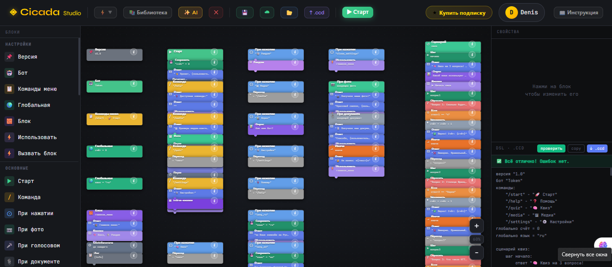

<div align="center">



<br/>

# ✦ Cicada Studio

### Конструктор Telegram-ботов на языке Cicada DSL

**Опиши своего бота словами — получи полностью рабочий Telegram-бот за секунды.**  
Без кода. Без программирования. Прямо из браузера.

<br/>

[](https://nodejs.org)
[](https://react.dev)
[](https://postgresql.org)
[](https://docker.com)
[](LICENSE)

<br/>

</div>

---

## ✦ Killer Feature — AI → Telegram Bot

Напишите по-русски, что должен делать ваш бот:

```
"Создай бота для кофейни: приветствие, меню с 5 позициями,
 кнопка заказа, QR-код для оплаты, FAQ"
```

↓ **Cicada Studio генерирует за 3–5 секунд** ↓

```cicada
бот "TOKEN"

при старте:
    ответ "Привет! Добро пожаловать в CoffeBot ☕"
    кнопки "📋 Меню" "❓ FAQ" "📷 QR оплата"

при нажатии "📋 Меню":
    ответ "Наше меню:\n• Эспрессо — 120₽\n• Капучино — 180₽\n• Латте — 200₽"
    кнопки "🛒 Заказать" "🏠 Назад"

при нажатии "📷 QR оплата":
    запустить qr_сценарий

сценарий qr_сценарий:
    шаг ввод:
        спросить "Введите сумму для QR:" → amount
    шаг ответ:
        ответ "💳 QR-код: https://api.qrserver.com/v1/create-qr-code/?data={amount}"
        завершить сценарий
```

> Никакого знания DSL не требуется. Просто опиши задачу — редактор сделает остальное.

---

## ⚡ Что такое Cicada Studio

**Cicada Studio** — это полноценная платформа для создания, запуска и управления Telegram-ботами. В основе — собственный язык **Cicada DSL**, специально созданный для описания диалоговой логики на русском языке.

| Компонент | Описание |
|---|---|
| 🤖 **AI-генерация** | Бот из текстового описания (Ollama и/или GROQ) |
| 🎨 **Визуальный редактор** | Drag-and-drop блоки + встроенная DSL-панель |
| ▶️ **Запуск из браузера** | Один клик — бот работает в Telegram |
| 🔒 **Sandbox** | Изолированное выполнение с лимитами по CPU/памяти/времени |
| ☁️ **Облачные проекты** | PostgreSQL: сохранение, загрузка, синхронизация |
| 👤 **Авторизация** | Email/пароль + Telegram OAuth + JWT + bcrypt |
| 🛡️ **Admin-панель** | Деньги, пользователи, боты, безопасность, система |

---

## 🧬 Язык Cicada DSL

Cicada DSL — декларативный язык с русскоязычным синтаксисом для описания сценариев Telegram-ботов.

### Основные конструкции

```cicada
# Объявление бота
бот "TG_BOT_TOKEN"

# Обработка команды /start
при старте:
    ответ "Привет, {пользователь.имя}!"
    кнопки "📦 Каталог" "💬 Поддержка" "👤 Профиль"

# Обработка нажатия кнопки
при нажатии "📦 Каталог":
    ответ "Выберите категорию:"
    кнопки "👟 Обувь" "👗 Одежда" "🔙 Назад"

# FSM-сценарий (многошаговый диалог)
сценарий регистрация:
    шаг имя:
        спросить "Как вас зовут?" → user_name

    шаг телефон:
        спросить "Введите номер телефона:" → user_phone

    шаг готово:
        сохранить "name" = user_name
        ответ "Готово! Вы зарегистрированы, {user_name} ✅"
        завершить сценарий

# Условная логика
при нажатии "👤 Профиль":
    если пользователь.подписка == "pro":
        ответ "PRO-аккаунт активен 🌟"
    иначе:
        ответ "Обновите подписку для доступа к PRO"
        кнопки "💳 Купить PRO"

# Сохранение данных
при нажатии "💾 Сохранить":
    сохранить "last_action" = "profile_view"
    ответ "Сохранено!"

# HTTP-запросы
при нажатии "🌤 Погода":
    http_get "https://wttr.in/Moscow?format=3" json weather_data → result
    ответ "Погода: {result}"
```

### Возможности языка

- **Кнопки** — инлайн и reply-клавиатуры
- **FSM-сценарии** — пошаговые диалоги с состоянием (`сценарий` + `шаг`)
- **Переменные** — сохранение и чтение данных пользователя (`сохранить`, `получить`)
- **Условия** — ветвление логики (`если` / `иначе`)
- **HTTP-запросы** — интеграция с внешними API
- **Системные переменные** — `пользователь.имя`, `пользователь.id`, `пользователь.username`
- **Форматирование** — шаблоны `{переменная}` в ответах

---

## 🎛️ Визуальный редактор

Редактор состоит из трёх панелей:

```
┌─────────────────┬────────────────────┬──────────────────┐
│   Блоки (слева) │   Холст (центр)    │  Свойства (права)│
│                 │                    │                  │
│  🤖 Бот         │  [Бот блок]        │  token: ...      │
│  🚀 При старте  │       ↓            │  name: ...       │
│  👆 При нажатии │  [При старте]      │                  │
│  💬 Ответ       │       ↓            │                  │
│  🔘 Кнопки      │  [Ответ]          │                  │
│  ❓ Спросить    │       ↓            │                  │
│  💾 Сохранить   │  [Кнопки]         │                  │
│  🔀 Сценарий    │                    │                  │
└─────────────────┴────────────────────┴──────────────────┘
```

**Функции редактора:**
- Drag-and-drop блоков на холст
- Zoom in/out, pan
- Авто-соединение блоков при перетаскивании
- Экспорт/импорт проекта в JSON
- Синхронизация DSL-панели с визуальным представлением в реальном времени
- **Проверка ошибок DSL** с подсветкой строк
- **Автоисправление** — одной кнопкой устраняет типичные ошибки
- **Библиотека модулей** — готовые шаблоны (QR-бот, FAQ, регистрация и др.)

---

## 🛡️ Безопасность

### Аутентификация
- **bcrypt** (cost factor 10) для хэширования паролей
- **JWT** токены + cookie-session (двойной слой)
- **Telegram OAuth** с проверкой подписи `HMAC-SHA256`
- Rate limiting на `/login`, `/register`, `/reset-password`

### DSL Sandbox
Каждый бот запускается в изолированном процессе (`child_process.spawn`) с жёсткими ограничениями:

| Лимит | По умолчанию | Переменная |
|---|---|---|
| Время выполнения | 5 минут | `DSL_MAX_RUNTIME_MS` |
| Размер кода | 100 КБ (байт UTF-8) | `DSL_MAX_CODE_BYTES` |
| Объём логов (stdout+stderr) | 80 000 символов | `DSL_MAX_LOG_CHARS` |

При превышении лимита — принудительная остановка (`SIGKILL`).

### Admin Panel
- Отдельная сессия от пользовательской
- `timingSafeEqual` для сравнения `ADMIN_KEY`
- Минимальная длина `ADMIN_KEY` — 16 символов
- Аудит всех административных действий

### Ответы API и ошибки

В теле ответов `/api/*` клиенту отдаются **только** заранее заданные короткие сообщения по полю `error`. Детали сбоев (цепочки вызовов, тексты ошибок сторонних API, БД) пишутся **только на сервер** (логи и раздел мониторинга в админке), чтобы не упрощать разведку и не светить внутреннюю реализацию.

---

## 🖥️ Admin-панель

Доступ по **`/satana`** (canonical URL; есть редирект со старых имён вида `.html`). Для входа используется `ADMIN_KEY` в `.env`.

### Разделы

**💰 Деньги** — управление планами подписок, цены, статистика платежей (CryptoBot)

**👥 Пользователи** — список пользователей с фильтрацией и поиском, карточка пользователя:
- История входов и IP-адреса
- Действия пользователя
- Логи бота в реальном времени
- Подписки и статус аккаунта
- Действия: бан/разбан, сброс пароля, назначение роли/уровня доступа, выдача подписки

**🤖 Боты / Продукт** — сводная статистика: активные боты, подписки, метрики использования

**🔒 Безопасность** — статус конфигурации:
- Длина и статус `ADMIN_KEY`
- JWT настройки
- Политика cookie
- Активные сессии
- Управление `GROQ_TOKEN` (1-3) через интерфейс

**🖥️ Система** — мониторинг сервера:
- Uptime, память, Node.js версия, PID
- Активные боты
- Лог ошибок API, Auth, системных ошибок
- Фильтрация логов по пользователю (email/ID)
- Журнал действий администратора

---

## 🚀 Быстрый старт

### Предварительные требования

- **Node.js 20+** и **npm**
- **PostgreSQL 14+**
- **Python 3 + pip** — для CLI `cicada` из пакета [cicada-tg](https://pypi.org/project/cicada-tg/) (исполнитель DSL в песочнице)
- Токен бота ([@BotFather](https://t.me/BotFather))
- Для AI-генерации: **Ollama** локально или **GROQ** ([console.groq.com](https://console.groq.com)); см. `env.example`

### Автоустановка: `bootstrap.sh`

На **Ubuntu/Debian (VPS)**, в **WSL** или в **Termux** можно поднять стек одним скриптом из корня проекта:

```bash
chmod +x bootstrap.sh
sudo bash bootstrap.sh           # VPS: от root

# При необходимости зафиксировать версию рантайма DSL:
sudo CICADA_TG_PIN=0.1.8 bash bootstrap.sh
```

Скрипт:

- ставит системные зависимости (**Node.js 20**, **PM2**, **PostgreSQL**, **Nginx** — кроме Termux), ставит **`cicada-tg`** с PyPI (по умолчанию **0.1.8**); при наличии `cicada` в `PATH` пропишет актуальный **`CICADA_BIN`** в `.env`;
- создаёт пользователя и БД PostgreSQL (на **Termux** используется `psql` от текущего пользователя, на Linux — `sudo -u postgres`);
- генерирует **`ADMIN_KEY`**, **`JWT_SECRET`** (≥32 символов для production) и при необходимости сам `.env`;
- в режиме **PROD** помогает с **Let's Encrypt**; в **LOCAL** — self-signed и прокси на Node.

После установки смотри итоговый блок в терминале (URL сайта, `/satana`, `pm2 logs server`).

### Ручная установка

```bash
# 1. Клонировать репозиторий
git clone https://github.com/Cicadadenis/cicada-studio.git
cd cicada-studio

# 2. Скопировать переменные окружения
cp env.example .env

# 3. Заполнить .env (см. раздел ниже): обязательно JWT_SECRET, ADMIN_KEY, БД, при production — NODE_ENV=production
nano .env

# 4. Установить CLI Cicada (рантайм для DSL)
pip install cicada-tg
# пропиши в .env путь: CICADA_BIN=$(command -v cicada)

# 5. Установить зависимости Node и (при необходимости) OAuth-пакеты
npm install
npm install passport passport-google-oauth20 express-session

# 6. Собрать frontend
npm run build

# 7. Запустить сервер
npm run server
```

По умолчанию API слушает порт из **`API_PORT`** в `.env` (часто **3001**). Фронт в dev: `npm run dev` (Vite). В production статика отдаётся из `dist/` (через Nginx или напрямую через Node — как настроишь).

### Запуск через Docker

```bash
# Запустить всё (приложение + PostgreSQL)
docker-compose up -d

# Просмотр логов
docker-compose logs -f app
```

---

## ⚙️ Переменные окружения

Ориентир — файл **`env.example`** в репозитории. Кратко:

### База данных
```env
DB_HOST=localhost
DB_PORT=5432
DB_NAME=app_db
DB_USER=app_user
DB_PASSWORD=strong_password_here
```

### Сервер и публичный URL
```env
API_HOST=0.0.0.0
API_PORT=3001
APP_URL=https://example.com
NODE_ENV=production
CICADA_BIN=/path/to/cicada
```

`APP_URL` (без завершающего `/`) используется для CORS в production, если не задан список **`CORS_ORIGINS`**.

### Vite (сборка фронта)
```env
VITE_API_URL=http://localhost:3001
VITE_API_TARGET=http://localhost:3001
VITE_ADMIN_EMAIL=admin@example.com
VITE_TG_BOT_NAME=your_bot_name
```

### Telegram
```env
TG_BOT_TOKEN=...
```

### Аутентификация и админка
```env
JWT_SECRET=...                    # в production не короче 32 символов
JWT_EXPIRES_SEC=604800
ADMIN_KEY=...                   # не короче 16 символов
# ADMIN_JWT_EXPIRES_SEC=28800
```

### Google OAuth (опционально)
```env
GOOGLE_CLIENT_ID=...
GOOGLE_CLIENT_SECRET=...
GOOGLE_CALLBACK_URL=https://example.com/api/auth/google/callback
```

### AI: Ollama и/или GROQ
```env
OLLAMA_URL=http://127.0.0.1:11434
OLLAMA_MODEL=qwen2.5:3b
GROQ_TOKEN=gsk_...
GROQ_TOKEN_2=gsk_...
GROQ_TOKEN_3=gsk_...
```

### DSL Sandbox (опционально)
```env
DSL_MAX_RUNTIME_MS=300000
DSL_MAX_CODE_BYTES=100000
DSL_MAX_LOG_CHARS=80000
```

### Email (Resend)
```env
RESEND_API_KEY=...
EMAIL_FROM=App Name <noreply@example.com>
```

### Оплата CryptoBot (опционально)
```env
CRYPTOBOT_TOKEN=...
```

---

## 📁 Структура проекта

```
cicada-studio/
├── src/                    # Frontend (React + Vite)
│   ├── App.jsx             # Главный компонент, редактор, DSL
│   ├── ModuleLibrary.jsx   # Библиотека готовых модулей
│   ├── DSLPanel.jsx        # DSL-редактор с подсветкой
│   ├── PropsPanel.jsx      # Панель свойств блока
│   └── dslLint.js          # Валидация и автоисправление DSL
├── services/
│   └── dslRunner.mjs       # Sandbox для запуска ботов
├── public/
│   └── satana.html         # Admin-панель
├── server.mjs              # Express backend
├── docker-compose.yml      # Docker Compose
├── Dockerfile              # Multi-stage Docker build
├── bootstrap.sh            # Автоустановка на VPS / WSL / Termux
├── .github/
│   └── workflows/
│       └── ci.yml          # GitHub Actions CI
└── env.example             # Шаблон переменных окружения
```

---

## 🔧 Разработка

```bash
# Запуск в dev-режиме (hot reload)
npm run dev          # frontend (Vite)
npm run server       # backend (Node.js)

# Проверка синтаксиса сервера
npm run check:server

# Сборка production
npm run build
```

### CI/CD

GitHub Actions автоматически при каждом `push` в `main`:
1. `npm ci` — установка зависимостей
2. `npm run check:server` — проверка синтаксиса backend
3. `npm run build` — сборка frontend

---

## 🗺️ Roadmap

### v1.1 — Архитектура
- [ ] Разделение `server.mjs` на `controllers/`, `services/`, `repositories/`
- [ ] Тесты (Jest) для DSL-валидатора и auth middleware
- [ ] OpenAPI / Swagger документация

### v1.2 — Продукт
- [ ] Платёжный webhook + автоматическое продление подписок
- [ ] Расширенная аналитика: DAU, retention, воронки
- [ ] Экспорт проекта в ZIP + деплой на свой сервер
- [ ] Совместное редактирование (team workspace)

### v1.3 — AI
- [ ] Улучшение промптов генерации (few-shot примеры)
- [ ] AI-объяснение ошибок DSL ("почему сломалось?")
- [ ] Автодополнение в DSL-редакторе

### v2.0 — Платформа
- [ ] Маркетплейс шаблонов ботов
- [ ] Webhooks для интеграции с внешними системами
- [ ] Мобильное приложение (React Native)

---

## 🧑‍💻 Технологический стек

| Слой | Технология |
|---|---|
| **Frontend** | React 18, Vite 5 |
| **Backend** | Node.js 20, Express 4 |
| **Database** | PostgreSQL 16, `pg` driver |
| **Auth** | JWT, bcryptjs, cookie-parser |
| **AI** | Ollama, GROQ API (Llama и др.), переменные `OLLAMA_*` / `GROQ_TOKEN*` |
| **DevOps** | Docker, docker-compose, GitHub Actions |
| **Security** | Rate limiting, timingSafeEqual, CORS |

---

## 📄 Лицензия

MIT © 2026 [Cicada3301](https://github.com/Cicadadenis)

---

<div align="center">

**Cicada Studio** — Telegram-боты на языке **Cicada**, от **Cicada3301**

*Сделано с ♥ для тех, кто хочет автоматизировать бизнес без программирования*

</div>
