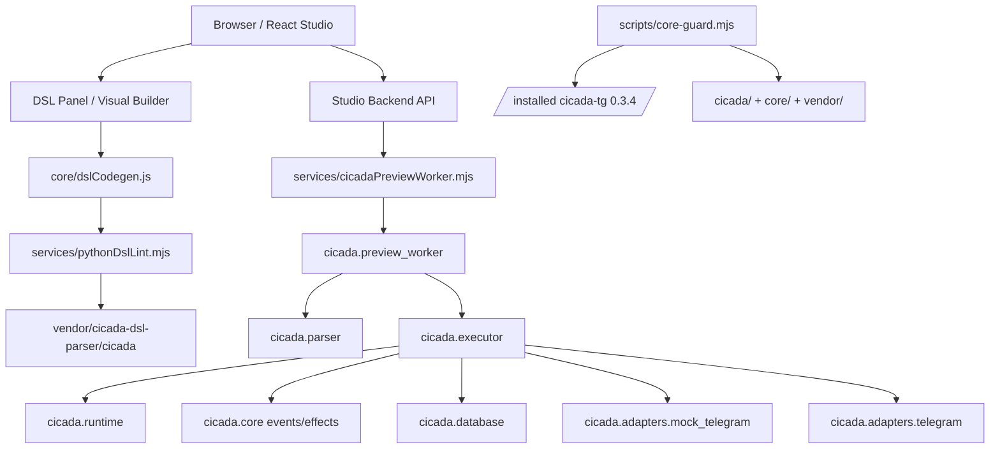

# Dependency Graph

Generated for the `cicada-tg==0.3.4` compatibility boundary.

Boundaries:

- `Browser`, `DSL`, and `Codegen` are Studio/editor responsibilities.
- `Parser`, `Executor`, `Runtime`, `CoreEvents`, `DB`, and adapters are canonical core responsibilities.
- `PreviewClient` is an adapter boundary, not a runtime override.
