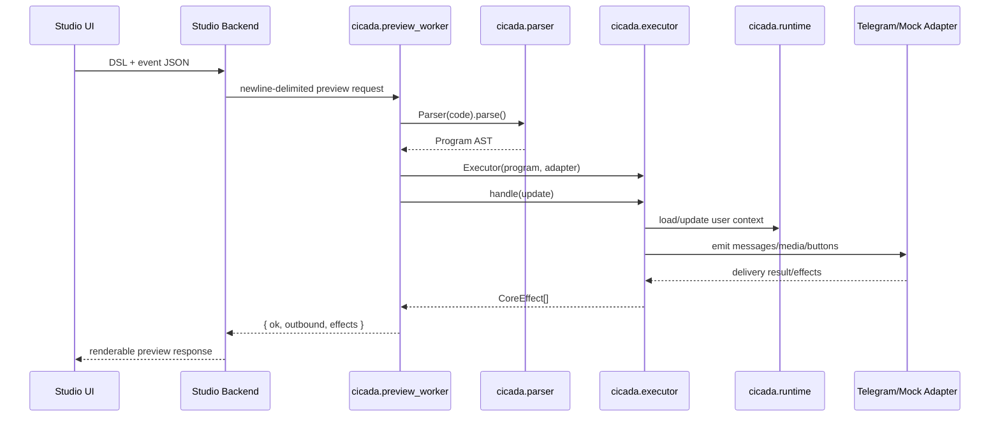

# Runtime Graph

Canonical runtime flow for `cicada-tg==0.3.3`.

Runtime ownership:

- Event normalization, parser semantics, scenario state, executor dispatch, effects, and adapter contracts are core-owned.
- Studio may only send input and render output.
- Any behavior outside this path belongs in adapters/extensions, not in CORE.
